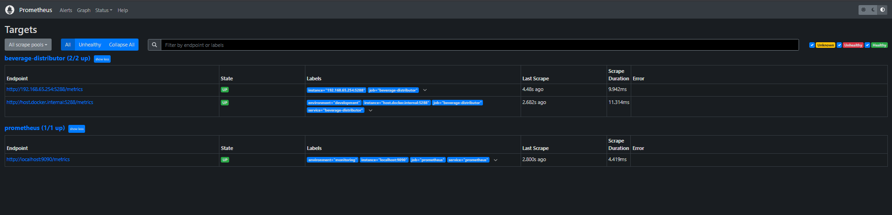
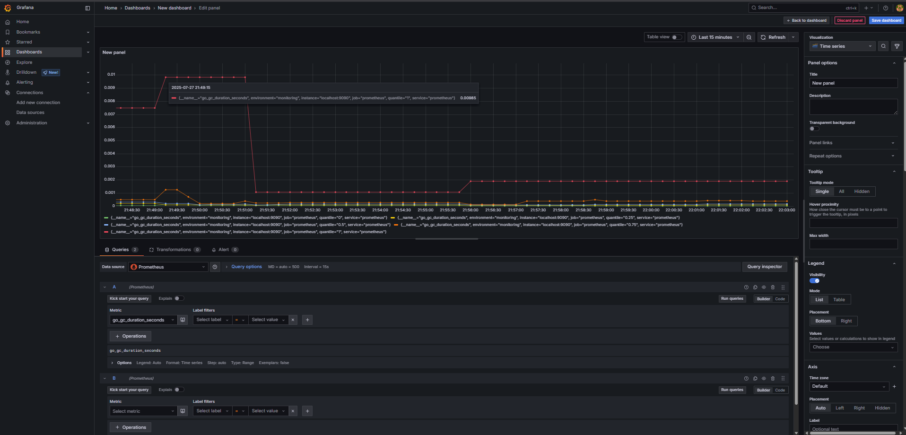
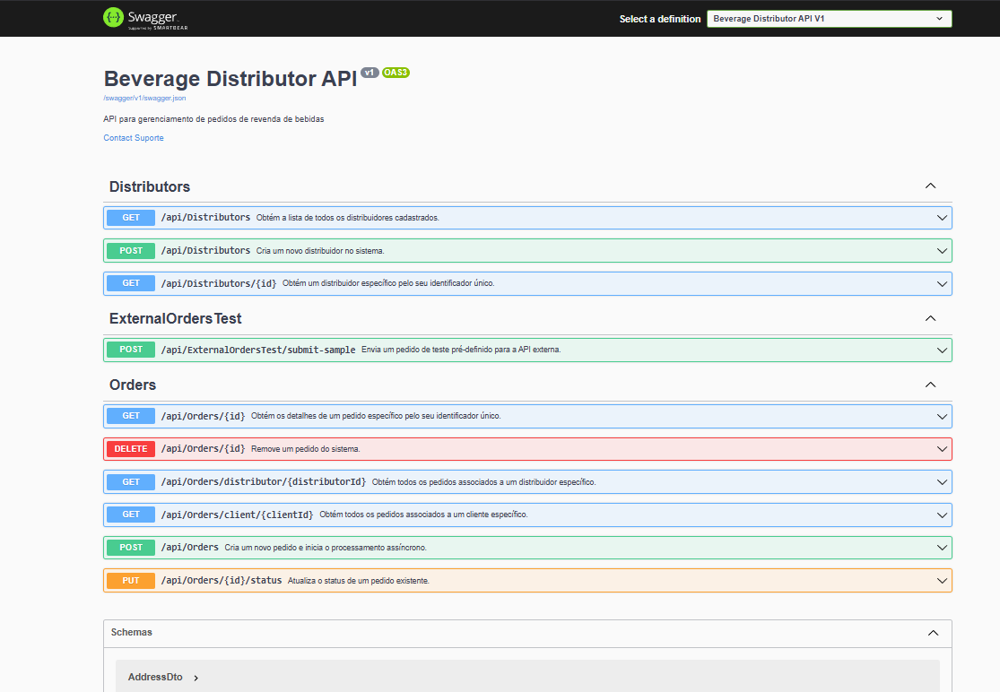
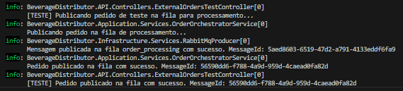
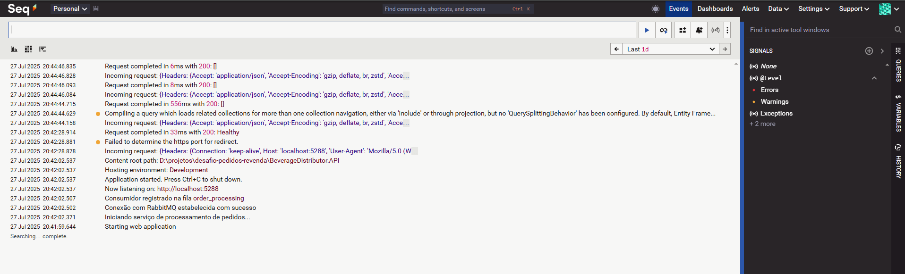
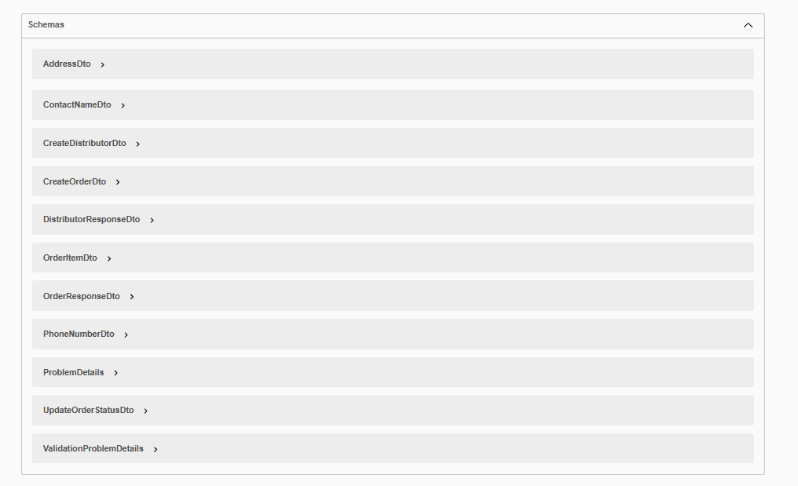
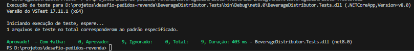

# Sistema de Distribuição de Bebidas 

Sistema de gerenciamento de pedidos para revendas de bebidas, desenvolvido em .NET 8.0 seguindo princípios de Clean Architecture.

## 🚀 Como Executar

### Pré-requisitos

- Docker e Docker Compose
- .NET 8.0 SDK

### Passo a Passo

1. **Iniciar a Infraestrutura**
   ```bash
   docker-compose up -d
   ```
   Isso irá iniciar o PostgreSQL e RabbitMQ.

2. **Configurar a Aplicação**
   - Certifique-se de que o arquivo `appsettings.Development.json` contém a string de conexão correta:
     ```json
     "ConnectionStrings": {
       "DefaultConnection": "Server=localhost;Port=5432;Database=beverage_distributor;User Id=postgres;Password=postgres;"
     }
     ```

3. **Aplicar as Migrations**
   ```bash
   cd BeverageDistributor.API
   dotnet ef database update --project ../BeverageDistributor.Infrastructure
   ```

4. **Executar a Aplicação**
   ```bash
   dotnet run --project BeverageDistributor.API
   ```
   A API estará disponível em `http://localhost:5000` e a documentação Swagger em `http://localhost:5000/swagger`.

### Acessando o Banco de Dados
- **Host**: localhost
- **Porta**: 5432
- **Banco de Dados**: beverage_distributor
- **Usuário**: postgres
- **Senha**: postgres

### Acessando o pgAdmin
- **URL**: http://localhost:5050
- **Email**: admin@admin.com
- **Senha**: admin

### Acessando o Serilog
- **URL**: http://localhost:5341
- **Email**: admin
- **Senha**: adminadmin

### Monitoramento com Prometheus e Grafana

O sistema inclui monitoramento em tempo real usando Prometheus e Grafana.

#### Acessando o Prometheus
- **URL**: http://localhost:9090
- **Métricas da aplicação**: http://localhost:5288/metrics

#### Acessando o Grafana
- **URL**: http://localhost:3000
- **Usuário**: admin
- **Senha**: admin

#### Métricas Coletadas
- Requisições HTTP (total, em andamento, duração)
- Uso de memória e CPU
- Tempo de resposta das APIs
- Status de saúde dos serviços





## 🎯 Sobre o Projeto

Solução para o desafio de implementação de um sistema de pedidos para revendas de bebidas, com foco em:
- Recebimento de pedidos de clientes
- Consolidação e envio de pedidos para a fornecedora de bebidas
- Garantia de entrega mesmo com falhas na API externa

## 🏗️ Arquitetura da Solução

### Visão Geral da Arquitetura

```
┌───────────────────────────────────────────────────────────────────────────────────┐
│                    SISTEMA DE DISTRIBUIÇÃO DE BEBIDAS (ALTA DISPONIBILIDADE)      │
│                                                                                   │
│  ┌─────────────────┐     ┌─────────────────────┐      ┌─────────────────────┐     │
│  │                 │     │                     │      │                     │     │
│  │  API Controller │◄────►│  OrderOrchestrator │◄────►│  RabbitMQ           │     │
│  │  (Stateless)    │ HTTP │  Service           │  🚀  │  (Fila de Pedidos)  │     │
│  └─────────────────┘     └──────────┬──────────┘      └──────────┬──────────┘     │
│                                     │                            │                │
│                            ┌────────▼──────────┐     ┌──────────▼──────────┐     │
│                            │                   │     │                     │     │
│                            │  PostgreSQL       │     │  Worker Service     │     │
│                            │  (Dados           │     │  (Processamento     │     │
│                            │   Transacionais)  │     │   Inicial)          │     │
│                            └───────────────────┘     └──────────┬──────────┘     │
│                                                                 │                │
│  ┌─────────────────┐     ┌─────────────────────┐     ┌──────────▼──────────┐     │
│  │                 │     │                     │     │                     │     │
│  │  API Externa    │◄────┤  External Order    │◄────┤  RabbitMQ            │     │
│  │  (Fornecedor)   │     │  Processor         │  🚀 │  (Fila Externa)     │     │
│  └─────────────────┘     └────────────────────┘     └──────────────────────┘    │
│                                                                                 │
└─────────────────────────────────────────────────────────────────────────────────┘

Principais Características de Resiliência:
• Stateless API: Escalabilidade horizontal ilimitada
• Fila de Mensagens: Garante entrega exatamente uma vez (at-least-once delivery)
• Processamento Assíncrono: Isola falhas e permite retentativas automáticas
• Circuit Breaker: Evita sobrecarga em falhas da API externa
• Persistência Dupla: Banco de dados + Fila para recuperação de falhas
• Monitoramento em Tempo Real: Métricas, logs e rastreamento distribuído
```

### Fluxo de Processamento de Pedidos com Garantia de Entrega

1. **Recepção do Pedido (HTTP)**
   - Cliente envia pedido via API REST para `/api/orders`
   - Validação síncrona dos dados de entrada
   - Resposta imediata com ID de rastreamento

2. **Processamento Inicial (Síncrono)**
   - Persistência inicial no banco de dados com status `Received`
   - Publicação na fila `order-processing` com confirmação de escrita
   - Retorno de confirmação ao cliente

3. **Processamento Assíncrono (Worker 1)**
   - Consumo da fila `order-processing` com reconhecimento manual (ack/nack)
   - Validações de negócio e regras de domínio
   - Publicação na fila `external-api-queue` para integração externa

4. **Integração com Fornecedor (Worker 2)**
   - Consumo da fila `external-api-queue` com reconhecimento manual
   - Validação de quantidade mínima (1000 unidades)
   - Tentativas de entrega com backoff exponencial
   - Circuit breaker para falhas recorrentes
   - Dead-letter queue para falhas persistentes

5. **Atualização de Status**
   - Atualização do status no banco de dados
   - Notificações de eventos (opcional)
   - Logs detalhados para auditoria

**Melhorias Implementadas:**
- Separação clara das responsabilidades em dois workers independentes
- Duas filas dedicadas para cada estágio crítico
- Isolamento de falhas entre processamento interno e externo
- Escalabilidade independente para cada estágio

**Garantias de Entrega:**
- ✅ Mensagens não são perdidas (persistência em disco no RabbitMQ)
- ✅ Processamento exatamente uma vez (idempotência implementada)
- ✅ Isolamento de falhas entre estágios
- ✅ Recuperação automática de falhas
- ✅ Escalabilidade horizontal independente


### Estrutura do Projeto

```
BeverageDistributor.API/
├── Controllers/           # Controladores da API (Orders, Distributors, HealthCheck, ExternalOrdersTest)
├── Properties/            # Configurações e recursos da aplicação
└── Program.cs             # Configuração e inicialização da aplicação

BeverageDistributor.Application/
├── DTOs/                  # Objetos de transferência de dados
├── Interfaces/            # Interfaces dos serviços
├── Mappings/              # Perfis de mapeamento AutoMapper
├── Services/              # Implementação dos serviços de aplicação
└── Validators/            # Validações de entrada

BeverageDistributor.Domain/
├── Entities/              # Entidades de domínio (Order, Distributor, etc.)
├── Enums/                 # Enumeradores
├── Exceptions/            # Exceções personalizadas
├── Interfaces/            # Interfaces de repositório
└── ValueObjects/          # Objetos de valor

BeverageDistributor.Infrastructure/
├── Migrations/            # Migrações do banco de dados
├── Persistence/           # Configurações do contexto do banco de dados
├── Repositories/          # Implementações dos repositórios
└── Services/              # Serviços de infraestrutura (ExternalOrderService, etc.)

BeverageDistributor.Tests/ # Testes automatizados
└── ...
```

### Endpoints da API

#### Pedidos (Orders)
- `GET    /api/orders` - Lista todos os pedidos
- `GET    /api/orders/{id}` - Obtém um pedido pelo ID
- `POST   /api/orders` - Cria um novo pedido
- `GET    /api/orders/distributor/{distributorId}` - Lista pedidos por distribuidor
- `GET    /api/orders/client/{clientId}` - Lista pedidos por cliente

#### Distribuidores (Distributors)
- `GET    /api/distributors` - Lista todos os distribuidores
- `GET    /api/distributors/{id}` - Obtém um distribuidor pelo ID
- `POST   /api/distributors` - Cria um novo distribuidor
- `PUT    /api/distributors/{id}` - Atualiza um distribuidor existente
- `DELETE /api/distributors/{id}` - Remove um distribuidor

#### Saúde da Aplicação (HealthCheck)
- `GET    /api/healthcheck` - Verifica a saúde da aplicação e suas dependências

#### Testes de Integração (ExternalOrdersTest)
- `POST   /api/externalorderstest/submit-sample` - Envia um pedido de teste para a API externa
- `POST   /api/externalorderstest/simulate-failure` - Simula uma falha na API externa para testes

> **Nota:** Os endpoints em `ExternalOrdersTestController` são apenas para ambientes de desenvolvimento e teste, e não devem ser usados em produção.

## 🛠️ Tecnologias Utilizadas

### Core
- **.NET 8.0** com ASP.NET Core Web API
- **Entity Framework Core 8.0** para acesso a dados
- **FluentValidation** para validação de requisições

### Infraestrutura
- **PostgreSQL** como banco de dados principal
- **RabbitMQ** para processamento assíncrono de pedidos
- **Serilog** para logging estruturado
- **Polly** para políticas de resiliência

### Qualidade
- **xUnit** para testes unitários
- **Moq** para mocks em testes
- **Swagger/OpenAPI** para documentação da API

## 🚀 Como Executar

### Pré-requisitos

- .NET 8.0 SDK
- Docker e Docker Compose

### Variáveis de Ambiente

Crie um arquivo `.env` na raiz do projeto com as seguintes variáveis:

```ini
# Banco de Dados PostgreSQL
POSTGRES_DB=beverage_distributor
POSTGRES_USER=postgres
POSTGRES_PASSWORD=postgres

# RabbitMQ
RABBITMQ_DEFAULT_USER=guest
RABBITMQ_DEFAULT_PASS=guest

# API Externa
EXTERNAL_API__BASEURL=https://api.external-distributor.com
EXTERNAL_API__ORDERENDPOINT=/api/orders
EXTERNAL_API__APIKEY=your-api-key-here
EXTERNAL_API__TIMEOUTSECONDS=30
EXTERNAL_API__RETRYCOUNT=3
EXTERNAL_API__CIRCUITBREAKERFAILURETHRESHOLD=0.5
EXTERNAL_API__CIRCUITBREAKERSAMPLINGDURATIONSECONDS=60
EXTERNAL_API__CIRCUITBREAKERMINIMUMTHROUGHPUT=10
EXTERNAL_API__CIRCUITBREAKERDURATIONOFSECONDS=60

# Processamento de Pedidos
ORDERPROCESSING__MINORDERQUANTITY=1000
ORDERPROCESSING__MAXRETRYATTEMPTS=3
ORDERPROCESSING__RETRYDELAYSECONDS=5
```

Ou configure diretamente no arquivo `appsettings.json` na pasta `BeverageDistributor.API`.

### Executando com Docker Compose

1. **Clone o repositório**
   ```bash
   git clone https://github.com/luigibreda/desafio-pedidos-revenda.git
   cd desafio-pedidos-revenda
   ```

2. **Inicie os containers**
   ```bash
   docker-compose up -d
   ```

3. **Acesse a aplicação**
   - API: http://localhost:8080
   - Swagger UI: http://localhost:8080/swagger
   - RabbitMQ Management: http://localhost:15672 (guest/guest)
   - PGAdmin: http://localhost:5050 (admin@admin.com/admin)

### Configuração

As variáveis de ambiente podem ser configuradas no arquivo `.env` ou diretamente no `docker-compose.yml`.

### Execução com Docker

```bash
# Suba toda a infraestrutura
docker-compose up -d

# A aplicação estará disponível em http://localhost:8080
```

## 📋 Funcionalidades Principais

### 1. Gestão de Pedidos

#### Recebimento de Pedidos
- Aceita pedidos de qualquer quantidade
- Validação de dados de entrada
- Resposta imediata com confirmação de recebimento

#### Processamento Assíncrono
- Fila de mensagens com RabbitMQ
- Validação de quantidade mínima (1000 unidades) apenas no envio para a fornecedora de bebidas
- Dead-letter queue para tratamento de erros

### 2. Observabilidade

#### Logs Estruturados
- Níveis de log configuráveis
- Formato JSON para fácil análise
- Rastreamento de erros com correlation ID

#### Métricas
- Health checks para monitoramento
- Métricas de performance
- Status da fila de mensagens

### 3. Resiliência

- Retry automático em falhas de rede
- Circuit breaker para evitar sobrecarga
- Timeout configurável para chamadas externas

## 🔧 Configuração

### Variáveis de Ambiente

```bash
# Banco de Dados
POSTGRES_DB=beverage_distributor
POSTGRES_USER=postgres
POSTGRES_PASSWORD=postgres

# RabbitMQ
RABBITMQ_DEFAULT_USER=guest
RABBITMQ_DEFAULT_PASS=guest

# Aplicação
ASPNETCORE_ENVIRONMENT=Development
ASPNETCORE_URLS=http://+:80
```

### Exemplo de Requisição

```http
POST /api/orders
Content-Type: application/json

{
  "clientId": "cliente-123",
  "items": [
    {
      "productId": "prod-001",
      "productName": "Skol 350ml",
      "quantity": 50,
      "unitPrice": 2.50
    }
  ]
}
```

## 📸 Demonstração

### 1. Swagger UI


### 2. Logs de Observabilidade



### 3. Schemas


## 🎯 Pontos importantes

### ✅ Implementado
- [x] Modelagem de domínio para pedidos e itens
- [x] Separação clara entre pedidos de clientes e envio para a fornecedora de bebidas
- [x] Tratamento adequado da regra de quantidade mínima (1000 unidades)
- [x] Código limpo e bem estruturado seguindo Clean Architecture
- [x] Testes automatizados básicos
- [x] Documentação básica da API
- [x] Logging básico com níveis apropriados
- [x] Health check básico para banco de dados
- [x] Circuit breaker para chamadas à API externa
- [x] Retry com backoff exponencial

### ⚠️ Parcialmente Implementado
- [~] Logs estruturados (básico, formato texto, não JSON)
- [~] Rastreabilidade de erros (básica, sem correlação automática)
- [~] Métricas de performance detalhadas (implementação básica via Prometheus)
- [~] Health checks avançados (básicos implementados, faltando RabbitMQ e API externa)
- [~] Monitoramento de recursos

### ❌ Não Implementado
- [ ] 

## 🧪 Testes

### Executando os Testes

```bash
dotnet test
```


## 📊 Observabilidade

### Health Checks

A aplicação possui health checks básicos configurados:

- ✅ **Banco de Dados**: Verificação de conectividade com PostgreSQL
- ❌ **Message Broker**: Status do RabbitMQ (não implementado)
- ❌ **APIs Externas**: Disponibilidade da API da distribuidora (não implementado)
- ❌ **Dependências**: Status geral do sistema (apenas banco de dados implementado)

Acesse: `GET /health` para verificação básica de saúde da aplicação.

### Logging Estruturado

A aplicação utiliza o sistema de logging integrado do ASP.NET Core com as seguintes características:

- ✅ **Níveis de Log**: Suporte a Debug, Information, Warning, Error, Critical
- ✅ **Contexto de Negócio**: Logs incluem informações relevantes do pedido
- ⚠️ **Correlação de Requisições**: Implementação básica via logs manuais
- ❌ **Formato JSON**: Logs em formato de texto simples (não estruturado em JSON)

Exemplo de log implementado:
```
[Information] Tentativa 1 de envio do pedido à API externa. Motivo: 500
[Warning] Circuito aberto por 60000ms devido a: 500 Internal Server Error
[Information] Circuito fechado, as requisições serão permitidas novamente
```

### 📊 Métricas e Monitoramento

A arquitetura de monitoramento foi projetada para fornecer visibilidade completa sobre o desempenho e saúde da aplicação. A implementação atual estabelece uma base sólida que pode ser facilmente expandida conforme necessário.

#### ✅ Implementado e Funcional

**Infraestrutura Básica**
- **Prometheus**: Coleta e armazena métricas em tempo real
- **Grafana**: Visualização de dashboards personalizáveis
- **Endpoint de Métricas**: `/metrics` expondo métricas no formato Prometheus

**Métricas do ASP.NET Core**
- **HTTP**: Contagem, duração e requisições em andamento
- **Runtime**: Uso de memória, GC, thread pool e exceções
- **Health Checks**: Verificação de saúde do banco de dados

**Logging Estruturado**
- Níveis de log (Debug, Info, Warning, Error, Critical)
- Contexto de negócio em todas as mensagens
- Integração com Seq para análise de logs

#### 🔄 Parcialmente Implementado

**Métricas de Negócio**
- Contagem básica de pedidos processados
- Status de pedidos (criados, processados, falhas)

**Health Checks**
- Verificação de conectividade com o banco de dados
- Status básico da aplicação

#### 🚀 Melhorias Planejadas

**Métricas Avançadas**
```csharp
// Exemplo de métricas personalizadas que podem ser adicionadas
var ordersProcessed = meter.CreateCounter<long>("orders_processed_total", "Número de pedidos processados");
var orderProcessingTime = meter.CreateHistogram<double>("order_processing_seconds", "Tempo de processamento dos pedidos");
```

**Integrações**
- Alertas no Grafana para métricas críticas
- Notificações via Slack/Email para incidentes
- Métricas customizadas para o domínio de negócio

**Observabilidade**
- Traces distribuídos com OpenTelemetry
- Logs estruturados em JSON
- Rastreamento de requisições entre serviços

**Monitoramento de Dependências**
- Health checks para RabbitMQ
- Verificação de conectividade com APIs externas
- Métricas de latência de rede

#### 📈 Próximos Passos

1. **Métricas de Negócio**
   - Taxa de conversão de pedidos
   - Tempo médio de processamento por distribuidor
   - Taxa de falhas por tipo de operação

2. **Resiliência**
   - Circuit breaker para dependências externas
   - Métricas de retry/backoff
   - Timeouts configuráveis

3. **Observabilidade**
   - Correlação de logs com traces
   - Análise de causa raiz automatizada
   - Dashboards específicos por equipe

**Nota Técnica**: A arquitetura atual foi projetada para ser extensível, permitindo a adição de novas métricas e fontes de dados com mínimo esforço. A estrutura de monitoramento pode ser expandida para incluir APM, rastreamento distribuído e análise de logs avançada conforme necessário.

### Tratamento de Indisponibilidade da API Externa

1. **Detecção de Falha**: Circuit breaker monitora falhas consecutivas
2. **Armazenamento Local**: Pedidos são persistidos localmente
3. **Retry com Backoff**: Tentativas com intervalos exponenciais
4. **Recuperação**: Processamento automático quando serviço volta

## 🤝 Considerações Técnicas

### Escolhas Arquiteturais

1. **DDD sobre CQRS**: Optei por DDD puro devido ao tempo limitado, mas a arquitetura permite evolução para CQRS facilmente
## 🏆 Considerações Finais

### Decisões de Projeto

1. **Arquitetura em Camadas**
   - Separação clara de responsabilidades
   - Fácil manutenção e evolução
   - Testabilidade aprimorada

2. **Resiliência**
   - Tratamento robusto de falhas
   - Garantia de entrega das mensagens
   - Recuperação automática

3. **Escalabilidade**
   - Processamento assíncrono
   - Baixo acoplamento entre serviços
   - Fácil escalabilidade horizontal


---

*Desenvolvido como parte do desafio técnico para Desenvolvedor Sênior*